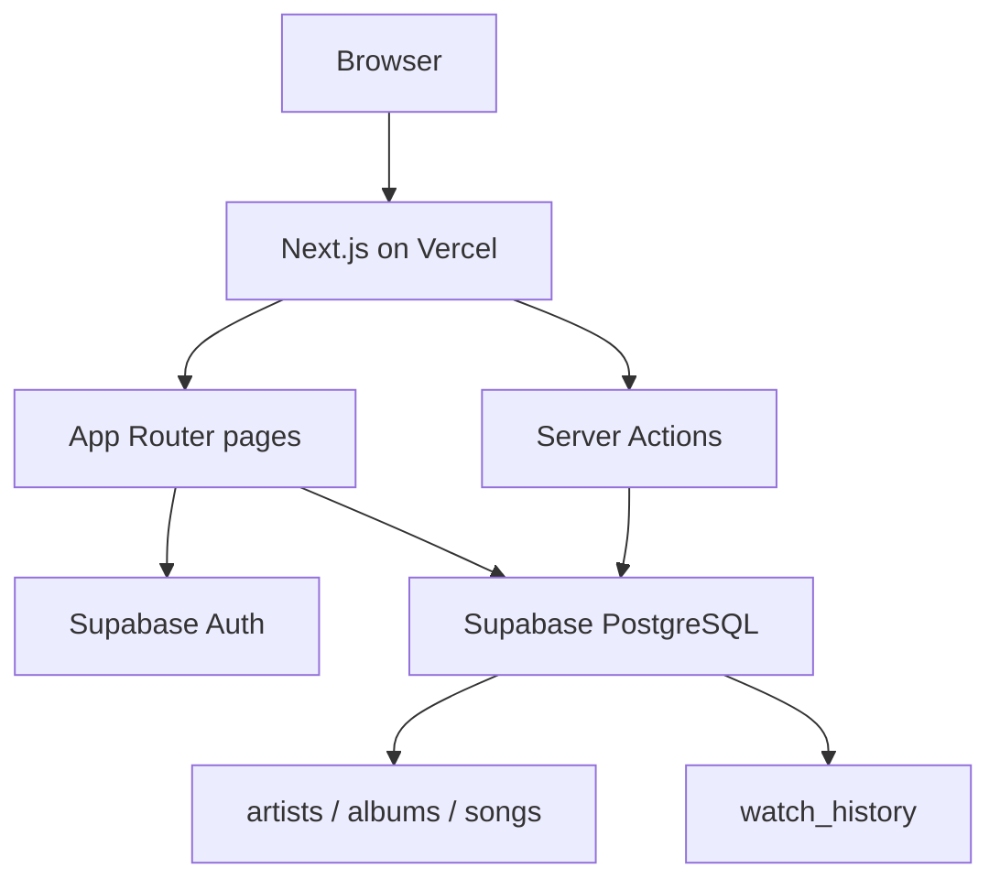
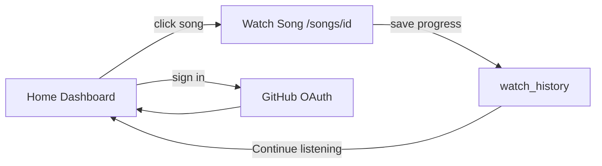

# architecture.md

````md
# next2026 Architecture

## Overview

next2026 is a music streaming demo focused on three capabilities: discovering songs on a home dashboard, watching songs via embedded YouTube playback, and persisting per-user watch history surfaced as **Continue listening** on the home page. The app uses a serverless stack — Next.js on Vercel with Supabase for auth and PostgreSQL — and is intentionally small in scope.

### Goals

- Fast deployment
- Low maintenance
- Serverless
- Responsive UI
- Personalized continue listening for signed-in users

---

# Technology Stack

| Layer | Technology |
|-------|------------|
| Framework | Next.js 16 (App Router) |
| UI | React 19, Tailwind CSS 4 |
| Database | Supabase PostgreSQL |
| Auth | Supabase Auth (GitHub OAuth) |
| Data access | Supabase JS client + `libs/models/*` |
| Deployment | Vercel |

---

# System Architecture



**Authentication** is cross-cutting infrastructure (GitHub OAuth via Supabase). It is required for watch history but is not a standalone product feature.

---

# Data Model

Existing catalog (seeded in `libs/dump.sql`):

```text
artists ──< albums ──< songs
```

Songs store a `youtube_url` for embedded playback. No file storage buckets are needed for these features.

### watch_history (new)

| Column | Type | Notes |
|--------|------|-------|
| id | SERIAL PK | |
| user_id | UUID FK | References `auth.users(id)` |
| song_id | INTEGER FK | References `songs(id)` |
| progress | INTEGER | Seconds watched (default 0) |
| watched_at | TIMESTAMPTZ | Last watched timestamp |

Unique constraint on `(user_id, song_id)` — one row per user per song, updated on each watch.

### Row Level Security

- **watch_history** — users can read and write only their own rows
- **artists, albums, songs** — public read (seed data)

---

# Features

## 1. Home Dashboard (`/`)

Server-driven landing page replacing the current placeholder.

### Sections

- **Hero banner** — one featured song (random or latest from seed data)
- **Discover songs** — responsive grid of song cards (cover, title, artist, duration); each card links to `/songs/[id]`
- **Continue listening** — horizontal scroll of recently watched songs for the signed-in user, with resume progress; hidden or shows a sign-in prompt when anonymous

### Data

- `libs/models/song.js` — extend with queries such as `getFeatured` and `getDiscoverList`
- `libs/models/watchHistory.js` — new module to list recent history for the current user

### UI

Follow visual direction in `docs/plan/ui.md` (dark theme, song cards, hero layout). Omit search bar, category chips, and other out-of-scope navigation.

---

## 2. Watch Song (`/songs/[id]`)

Evolve the existing song page — keep the route, enhance behavior.

### Behavior

- YouTube embed player (existing)
- Song metadata: title, artist (join via album → artist), duration
- For signed-in users: upsert `watch_history` on play and on periodic progress updates (`user_id`, `song_id`, `progress`, `watched_at`)
- Client component tracks player progress; server action or model method performs the upsert

### Out of scope on this page

Related songs, comments, likes, favorites, artist profile pages.

---

## 3. User Watch History (home only)

No dedicated `/history` route. History is surfaced exclusively through **Continue listening** on the home dashboard.

### Behavior

- Auto-save while watching (see Watch Song above)
- Home dashboard reads recent rows ordered by `watched_at`
- Cards show progress so users can resume where they left off
- Anonymous users can browse and watch; history requires sign-in

---

# Folder Structure

```text
app/
  page.jsx                 # Home Dashboard
  songs/[id]/page.jsx      # Watch Song
  layout.tsx

components/
  Navbar.jsx
  Footer.jsx
  GithubSignInButton.jsx
  dashboard/               # HeroBanner, SongCard, ContinueListening
  player/                  # VideoPlayer (client)

libs/
  supabase.js
  authentication.js
  models/
    song.js
    watchHistory.js        # new
  dump.sql                 # add watch_history + RLS
```

---

# User Flow



---

# Authentication

- GitHub OAuth via `libs/authentication.js` (`signInWithGithub`, `getUser`, `signOut`)
- Sign-in triggered from Navbar or home page — no dedicated `/login` route
- Watch history requires a signed-in user; all other pages remain accessible anonymously

---

# Deployment

```text
GitHub → push → Vercel → production
```

Environment variables (`NEXT_PUBLIC_SUPABASE_URL`, `NEXT_PUBLIC_SUPABASE_KEY`) are configured in Vercel. See `docs/setup.md` for local and production setup.

---

# Implementation Order

1. Add `watch_history` table + RLS to `libs/dump.sql`
2. Create `libs/models/watchHistory.js` (upsert, list for user)
3. Extend `libs/models/song.js` (featured/discover queries for dashboard)
4. Build Home Dashboard UI (`app/page.jsx` + `components/dashboard/`)
5. Add progress tracking on watch page + history upsert

---

# Out of Scope

- Artist profile pages
- Search
- Categories
- Favorites and playlists
- Comments and likes
- Supabase Storage buckets
- Notifications
- Dedicated history page (`/history`)
````
