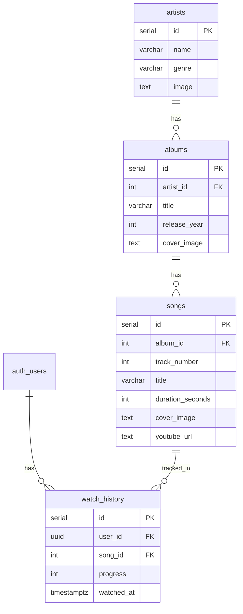

# database.md

````md
# next2026 Database Design

## Overview

Supabase PostgreSQL backs next2026's three features: Home Dashboard, Watch Song, and User Watch History. The catalog is seeded from [`libs/dump.sql`](../../libs/dump.sql). User-specific playback state lives in `watch_history`.

For application behavior see [`architecture.md`](architecture.md). For how fields appear on screen see [`ui.md`](ui.md).

---

# Entity Relationship



```text
auth.users
     │
     ▼
watch_history ──► songs ──► albums ──► artists
```

No custom `users` profile table, `favorites`, or `categories` in v1.

---

# auth.users

Managed by Supabase Auth (GitHub OAuth).

| Field | Type | Notes |
|-------|------|-------|
| id | uuid PK | Used as `watch_history.user_id` |
| email | text | From GitHub |
| user_metadata | jsonb | Avatar URL, display name |

---

# artists

Defined in `libs/dump.sql`.

| Column | Type | UI usage |
|--------|------|----------|
| id | SERIAL PK | Join key |
| name | VARCHAR(150) NOT NULL | Song card secondary text; watch page metadata |
| genre | VARCHAR(100) | Optional tertiary line on song card |
| image | TEXT | Circular avatar on song cards |

---

# albums

| Column | Type | UI usage |
|--------|------|----------|
| id | SERIAL PK | Join key |
| artist_id | INTEGER FK → artists(id) | Links to artist |
| title | VARCHAR(200) NOT NULL | Optional tertiary line on song card |
| release_year | INTEGER | Optional metadata |
| cover_image | TEXT | Fallback thumbnail when `songs.cover_image` is null |

---

# songs

| Column | Type | UI usage |
|--------|------|----------|
| id | SERIAL PK | Route `/songs/[id]` |
| album_id | INTEGER FK → albums(id) | Join to album and artist |
| track_number | INTEGER | Catalog ordering |
| title | VARCHAR(200) NOT NULL | Card title; watch page heading |
| duration_seconds | INTEGER | Duration badge (e.g. `3:48`); watch page metadata |
| cover_image | TEXT | Card thumbnail (primary) |
| youtube_url | TEXT | YouTube embed on watch page |

---

# watch_history

**Not yet in `libs/dump.sql`** — add as implementation step 1 per [`architecture.md`](architecture.md).

Tracks per-user playback progress. One row per user per song (upserted on each watch).

| Column | Type | Notes |
|--------|------|-------|
| id | SERIAL PK | |
| user_id | UUID FK | References `auth.users(id)` ON DELETE CASCADE |
| song_id | INTEGER FK | References `songs(id)` ON DELETE CASCADE |
| progress | INTEGER NOT NULL DEFAULT 0 | Seconds watched |
| watched_at | TIMESTAMPTZ NOT NULL DEFAULT now() | Last watched timestamp |

**Constraint:** `UNIQUE (user_id, song_id)`

### progress

Seconds elapsed in the video.

```text
Song duration:  240 sec
Current progress: 180 sec  →  75% on Continue listening bar
```

### DDL

```sql
CREATE TABLE watch_history (
  id           SERIAL PRIMARY KEY,
  user_id      UUID NOT NULL REFERENCES auth.users(id) ON DELETE CASCADE,
  song_id      INTEGER NOT NULL REFERENCES songs(id) ON DELETE CASCADE,
  progress     INTEGER NOT NULL DEFAULT 0,
  watched_at   TIMESTAMPTZ NOT NULL DEFAULT now(),
  UNIQUE (user_id, song_id)
);
```

---

# Feature-to-Data Mapping

| Feature | Tables / access |
|---------|-----------------|
| **Home — Continue listening** | `watch_history` JOIN `songs` JOIN `albums` JOIN `artists`; order by `watched_at DESC`; expose `progress`, `duration_seconds`, `cover_image`, `title`, artist `name`, `image` |
| **Home — Discover grid** | `songs` JOIN `albums` JOIN `artists`; list all or paginated subset |
| **Watch song** | `songs` by id with album/artist join; upsert `watch_history` on progress |
| **Auth** | `auth.users` only — no extra profile table |

---

# Example Queries

Documentation sketches for `libs/models/song.js` and `libs/models/watchHistory.js`.

### Discover list (SongGrid)

```sql
SELECT
  s.id,
  s.title,
  s.duration_seconds,
  s.cover_image,
  a.title   AS album_title,
  ar.name   AS artist_name,
  ar.genre,
  ar.image  AS artist_image
FROM songs s
JOIN albums a  ON a.id = s.album_id
JOIN artists ar ON ar.id = a.artist_id
ORDER BY s.id;
```

### Song detail (Watch page)

```sql
SELECT
  s.*,
  a.title   AS album_title,
  ar.name   AS artist_name,
  ar.image  AS artist_image
FROM songs s
JOIN albums a  ON a.id = s.album_id
JOIN artists ar ON ar.id = a.artist_id
WHERE s.id = $1;
```

### Continue listening

```sql
SELECT
  wh.progress,
  wh.watched_at,
  s.id,
  s.title,
  s.duration_seconds,
  s.cover_image,
  ar.name   AS artist_name,
  ar.image  AS artist_image
FROM watch_history wh
JOIN songs s   ON s.id = wh.song_id
JOIN albums a  ON a.id = s.album_id
JOIN artists ar ON ar.id = a.artist_id
WHERE wh.user_id = auth.uid()
ORDER BY wh.watched_at DESC
LIMIT 20;
```

### Upsert watch progress

```sql
INSERT INTO watch_history (user_id, song_id, progress, watched_at)
VALUES (auth.uid(), $1, $2, now())
ON CONFLICT (user_id, song_id)
DO UPDATE SET
  progress   = EXCLUDED.progress,
  watched_at = EXCLUDED.watched_at;
```

---

# Row Level Security

### Catalog (artists, albums, songs)

- Public `SELECT` — seed data is readable by everyone
- No client writes in v1 (seed via SQL editor / `dump.sql`)

### watch_history

Users can only access their own rows.

```sql
ALTER TABLE watch_history ENABLE ROW LEVEL SECURITY;

CREATE POLICY "Users read own history"
  ON watch_history FOR SELECT
  USING (user_id = auth.uid());

CREATE POLICY "Users insert own history"
  ON watch_history FOR INSERT
  WITH CHECK (user_id = auth.uid());

CREATE POLICY "Users update own history"
  ON watch_history FOR UPDATE
  USING (user_id = auth.uid());

CREATE POLICY "Users delete own history"
  ON watch_history FOR DELETE
  USING (user_id = auth.uid());
```

---

# Suggested Indexes

| Table | Index | Reason |
|-------|-------|--------|
| albums | `artist_id` | Artist join |
| songs | `album_id` | Album join |
| watch_history | `(user_id, watched_at DESC)` | Continue listening query |
| watch_history | `song_id` | FK lookups |

```sql
CREATE INDEX idx_albums_artist_id ON albums(artist_id);
CREATE INDEX idx_songs_album_id ON songs(album_id);
CREATE INDEX idx_watch_history_user_watched ON watch_history(user_id, watched_at DESC);
CREATE INDEX idx_watch_history_song_id ON watch_history(song_id);
```

---

# Implementation Note

Per [`architecture.md`](architecture.md), implementation order starts with:

1. Add `watch_history` table, indexes, and RLS policies to [`libs/dump.sql`](../../libs/dump.sql)
2. Create `libs/models/watchHistory.js`
3. Extend `libs/models/song.js` for discover and detail joins

No Supabase Storage buckets are required — images are external URLs and playback uses YouTube embeds.

---

# Out of Scope

- `videos` table (replaced by `songs`)
- `favorites`, playlists, likes
- `categories`, `video_categories`
- Custom `users` profile table
- Comments, notifications, search_history
- Supabase Storage buckets

See [`architecture.md`](architecture.md) and [`ui.md`](ui.md) for the full product scope.
````
